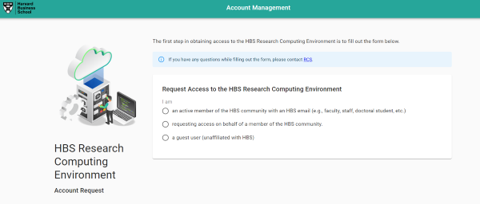
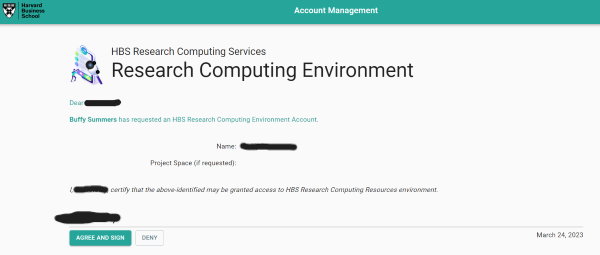
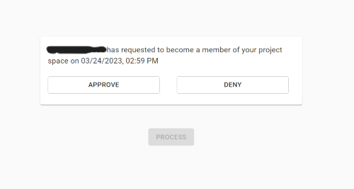

# New Account Management System

RCS, along with our IT partners, are excited to announce the upcoming replacement of our HBSGrid account and project space provisioning system effective **April 10, 2023**. This upgrade will significantly improve the speed, efficiency, and automation of creating and maintaining HBSGrid accounts and project spaces.

What will change for users on April 10th?
## New and Improved HBSGrid Account and Project Space Request Forms
We will be retiring our old account and project space request forms. Instead, you will use new forms to request new spaces and accounts (note that if you typically access forms from the [Online Requests tab of our website](https://www.hbs.edu/research-computing-services/help/online-requests.aspx), you can continue to do so; the links on that page will be updated to point to the new forms):

- Request a new HBSGrid account:
    
    **HBS Users**: <https://secure.hbs.edu/accountManagement/secure/research/account/new>
    
    **Guest Users**: <https://secure.hbs.edu/accountManagement/guest/research/account/new>
    
- Request a new HBSGrid project space: <https://secure.hbs.edu/accountManagement/secure/research/projectspace/new>

To add a user to a project space, request more space in your project folder, or make other project space changes, please continue to use [this project space change request form](https://forms.office.com/Pages/ResponsePage.aspx?id=Tlb9CUK_IUOPLbjkgvhjXMoIB6PHisBIlawtyGb7ibhUOEJQSUFSUkpUVUFRUEFHQzZGOVVMODNNRy4u) or contact RCS directly at <research@hbs.edu>.

## Streamlined Approval Emails
HBSGrid guest accounts (i.e., accounts for users who do not have HBS credentials) and all HBSGrid project spaces must have an approved HBS sponsor, usually a faculty member. The new system makes it easier than ever for sponsors to approve account requests and project space members by simply clicking a link in an email. 

!!! info inline end "Who can be a sponsor?"
    Faculty members may sponsor guest accounts and project spaces. 
    Doctoral students may also sponsor project spaces, but if the space 
    will include guest collaborators, the sponsor of the space must 
    be a faculty member or Jen Mucciarone.

### HBSGrid Accounts
#### For Guest Account Sponsors
When a guest user requests an account listing you as the sponsor, you will receive an automated email from `noreply@hbs.edu` with a link asking you to review and approve the request. Click the link to do so. If you do not approve or if you receive a request from a person you do not recognize, contact RCS at <research@hbs.edu>.

#### For HBS Users
Most account requests from members of the HBS community will be fulfilled by RCS within a business day. Account requests for Research Associates will first be routed to Research Staff Services for approval before the account is created. When your account is ready, you will receive an automated welcome email from `noreply@hbs.edu`.

#### For Guest Users
After you submit a guest account request, you will receive an automated email from `noreply@hbs.edu` asking you to review and sign a Guest User Agreement. Click the link to do so. Please note that this link will expire in 5 days.

You must accept the agreement for your account to be created. Once the account is created, you will receive an encrypted automated email from `encrypted@hbs.edu` containing your username and temporary HBSGrid password. **You may use this link only once and it expires in two weeks.** When you retrieve your password, you will receive instructions on how to change your password and download our VPN software so that you can access the HBSGrid.
### Project Space Access
When a new project space is ready or you have been added to a project space, you will receive an automated email from `noreply@hbs.edu` with the access information.
#### For Project Space Sponsors
If a user requests access to your project space, you will receive an automated email from `noreply@hbs.edu` notifying you of the request. Click the link to view and approve your outstanding requests. 

