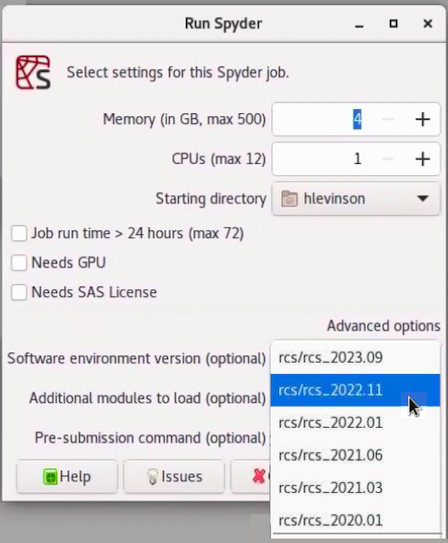

# 📦 Use Software Versions

A huge range of software applications, utilities, and libraries are
installed and configured for you. Whether you need *Rstudio* or
*Spyder*, *Julia* running in *VSCode*, popular R or Python packages,
of fully configured *Jupyter Notebooks*, we have you covered.

---

## Available software

The list of installed software is so large we make no effort to
enumerate everything here, but you can always get an up-to-date list
by opening a *terminal* on the Grid and running
``` sh
conda list
```

**Start with the expectation that all the software you need is already
installed and ready to use**. If that expectation is ever broken please
put in a request using our [discussion forum](https://github.com/hbs-rcs/hbsgrid-docs/discussions)
or [issue tracker](https://github.com/hbs-rcs/hbsgrid-docs/issues).

## Select desktop environment

Each time we update our software environments we preserve previous
versions so that you can roll back for reproducibility or if your code
stops working after an update. This section details the specific
software environment versions available.

As an illustration of the benefits of preserving historical software
environments, imagine that you have a python project and that your
*Pandas* code no longer works with the latest *Pandas* release in the
current software environment. In that case you can start *Spyder* and 
revert to a previous software environment in order to run your analysis 
using an older version of *Pandas*. The screen-shot below shows how to 
use the Software environment version selector to run and older version of
*python*.

{.media .media-block}

Software environments are named following a `rcs_year.version` scheme.
For example, the first environment released in 2021 is named
`rcs_2021.01`. The list below shows you key information about each
environment, including a command that you can run from the terminal to
get a detailed software version list.

## Select terminal environment

In order to facilitate reproducible research and analysis we preserve old software
environments so that you can switch back to them later if needed. These older
environments can be loaded using [Lmod](https://lmod.readthedocs.io/en/latest/010_user.html).

Running
``` sh
ml avail
```
will show you the available environments, named by date and version number.

For example, suppose that you have a python project and that your pandas code no
longer works with the latest pandas release in the current software environment.
In that case you can revert to a previous software environment and run your
analysis using an older version of pandas.

You can use the `ml` command from the terminal to *list*, *load*, and *unload* Lmod environment,
as shown below.

``` contents
      ml avail
      
------------------- /usr/local/app/rcs_bin/grid3/modulefiles -------------------
   rcs/rcs_2020.01        rcs/rcs_2021.03      rcs/rcs_2021.06
   rcs/rcs_2022.01 (D,L)  rcs/rcs_2022.06
   
        Where:
        D:  Default Module
        L:  Module is loaded
        
        Use "module spider" to find all possible modules.
        Use "module keyword key1 key2 ..." to search for all possible modules matching
        any of the "keys".
```

You can get detailed information about specific software modules using the
`ml spyder` command:

``` sh
module spyder rcs/rcs_2021.03
```

``` contents
----------------------------------------------------------------------------
  rcs: rcs/rcs_2022.01
----------------------------------------------------------------------------
    Description:
      Anaconda environment for research computing


    This module can be loaded directly: module load rcs/rcs_2022.01

    Help:
      Sets up environment for Data Science and Statistical computing.
      
      A huge list of software is avalable, including 'python', 'spyder', 'R', 
      'rstudio', 'emacs', 'vscode', rclone, ripgrep, nnn and much more.
      
      See https://hbs-rcs.github.io/hbsgrid-docs/ for documentation
      and https://hbs-rcs.github.io/hbsgrid-docs/environments/#rcs_2022.01
      for version-specific details.
      
      For a detailed software list open a terminal and run 
      
      conda env export -n rcs_2022.07
```

Finally you can use `ml` to load and unload specific environments.
``` sh
ml rcs_2021.03
```
will load the *rcs_2021.03* environment, and 
``` sh
ml -rcs_2021.03
```
will unload it.

Detailed [Lmod documentation is available here](https://lmod.readthedocs.io/en/latest/) and you can learn more about the environments available on the HBS Grid in the [Environments documentation](environments.md).


## Reproducing environments

The instructions above show how to use different software environment
versions *on the HBS Grid*. You may sometimes need to go a step further than this,
e.g., to continue your work on another system after you leave HBS, or to provide
reproduction instructions to meet a journal publication requirement. To do this you
need to know that 
*the environments described here are managed using the **conda** package manager on a **Linux** system*. 

You can recreate these environments on Linux systems by following the steps below:

!!! example "Re-create environments on another system"
    
    1. Obtain access to a Linux system. If you don't have have a suitable physical computer 
       you may wish to install one in a virtual machine. 
       Many [tutorials are available](https://brb.nci.nih.gov/seqtools/installUbuntu.html)
       to show you how to do this.
    2. Download the [MambaForge installer](https://github.com/conda-forge/miniforge#mambaforge)
       and install it on your Linux system.
    3. Create the [conda package list](https://docs.conda.io/projects/conda/en/latest/user-guide/tasks/manage-environments.html#building-identical-conda-environments).
    4. Copy the package list file to your Linux system and 
       [use `conda` to re-create the environment](https://docs.conda.io/projects/conda/en/latest/user-guide/tasks/manage-environments.html#building-identical-conda-environments).

In general it is not possible to exactly re-create these environments on Windows or Mac machines.
You can however examine the package lists and manually create environments with the same versions
of the software needed for your project.


## Create your own environments

!!! info inline end
    If you find that the software you need is not available in the standard HBS Grid software environments
    please consider putting in an installation request using our 
    [discussion forum](https://github.com/hbs-rcs/hbsgrid-docs/discussions)
    or [issue tracker](https://github.com/hbs-rcs/hbsgrid-docs/issues). This will help us maintain
    consistent environments useful to the whole HBS community.

If you prefer to create and manage your own software environments you may do so using 
[conda](https://docs.conda.io/projects/conda/en/latest/user-guide). This is the same package manager used
to maintain the system-wide software environments on the HBS Grid. `conda` has already been installed and
configured for you on the HBS Grid, making it easy to create and manage your own environments by following the 
[official conda environment documentation](https://docs.conda.io/projects/conda/en/latest/user-guide/getting-started.html#managing-environments).

You can share and reproduce your own `conda` environments on other computers and systems as well.
When setting up `conda` outside the HBSgrid we *strongly encourage* using the 
[MambaForge installer](https://github.com/conda-forge/miniforge#mambaforge) to get going with `conda` more quickly.
(`conda` is already installed and configured for you on the HBS Grid, there is no need to 
install it yourself there.)

Some useful documentation on [creating environments](https://docs.conda.io/projects/conda/en/latest/user-guide/getting-started.html#managing-environments),
[installing packages](https://docs.conda.io/projects/conda/en/latest/user-guide/getting-started.html#managing-packages),
and [sharing](https://docs.conda.io/projects/conda/en/latest/user-guide/tasks/manage-environments.html#sharing-an-environment)
is available, along with [a helpful tutorial](https://nbis-reproducible-research.readthedocs.io/en/course_2104/conda/).


## Environment versions

Current and historical software environments are described below.

### rcs_2022.01 {#rcs_2022.01}

This software environment is a user-friendly collection of
software and utilities designed to make data science and statistics
easier for HBS Grid users.

In this release we have added a large number of new statistics and
data science applications and packages, including:

-   [JASP](https://jasp-stats.org/ "https://jasp-stats.org/"), a free
    menu-driven statistics application similar to SPSS
-   [Cytoscape](https://cytoscape.org/ "https://cytoscape.org/"), an
    open source software platform for visualizing complex networks,
-   [DuckDB](https://duckdb.org/ "https://duckdb.org/"), an in-process
    SQL OLAP database management system
-   [texminer](https://www.rtextminer.com/ "https://www.rtextminer.com/"),
    functions for text mining and topic modeling in R
-   [Dedupe](https://docs.dedupe.io/en/latest/ "https://docs.dedupe.io/en/latest/"),
    a library that uses machine learning to perform de-duplication and
    entity resolution in Python
-   [awscli](https://aws.amazon.com/cli/ "https://aws.amazon.com/cli/"),
    a unified tool to manage your AWS services
-   [snakemake](https://snakemake.readthedocs.io/en/stable/ "https://snakemake.readthedocs.io/en/stable/"),
    a workflow management system to create reproducible and scalable
    data analyses

and many many more!

If you find a software program that you need is not yet available please
[let us know](https://github.com/hbs-rcs/hbsgrid-docs/discussions)
and we will try to install it for you.

The 2022.01 release also brings a huge number of application and package
updates, including:

-   Python updated to 3.9.9
-   R updated to 4.1.1
-   Octave updaed to 6.4
-   Julia updated to 1.7.1
-   RStudio updated to 2021.09.1
-   Spyder updated to 5.2.1
-   LibreOffice updated to 7.1.8
-   VSCode updated to 1.63.2
-   Emacs updated to 27.2
-   Arrow (C++, R and Python) updated to 6.0
-   Tensorflow updated to 2.7
-   PyTorch updated to 1.10.0
-   CUDA toolkit updated to 11.5.0
-   Jupyterlab updated to 3.10
-   MKL updated to 2021.4.0

and hundreds of others.

In this release we have also dropped support for several infrequently
used programs:

-   OCRfeeder -- use gImageReader for OCR instead
-   Gephi -- replaced by Cytoscape for network visualization
-   PSPP -- replaced by JASP, a modern statistics GUI that uses R under
    the hood
-   Meld -- use Diffuse for graphical text comparisony

[Documentation is available on line](https://hbs-rcs.github.io/hbsgrid-docs/)
or via the *HBS Grid help* application on the Grid. If you have any difficulties or
feature requests please [reach out on the discussion forum](https://github.com/hbs-rcs/hbsgrid-docs/discussions).

For complete environment details, open a terminal and run
``` sh
conda list -n rcs_2022.01
```

### rcs_2021.06 {#rcs_2021.06}

The `rcs_2021.06` environment was released in May 2021. It includes updated
*Octave*, *Python*, *QGIS*, *R*, *Stata*, and other software. Key software versions included in this
environment are listed below.

-   CUDAtoolkit 11.2
-   Spyder 5.0
-   Texlive 2021
-   Emacs 27.2
-   Julia 1.6.1
-   Jupyterlab 3.0
-   Mathematica 12
-   Matlab R2021a
-   Numpy 1.20
-   Octave 6.2
-   Pandas 1.2
-   Python 3.9
-   Pytorch 1.8
-   QGIS 3.18
-   R 4.0
-   R-tidyverse 1.3
-   SAS 9.4
-   Stata 17
-   Tensorflow 2.4

For complete environment details, open a terminal and run

``` sh
conda env export -n rcs_2021.06
```

### rcs_2021.03 {#rcs_2021.03}

The `rcs_2021.03` environment was released in March 2021. It includes updated
*Octave*, *Python*, *QGIS*, *R*, *Stata*, and other software. Key software versions included in this
environment are listed below.

-   CUDAtoolkit 10.1
-   Emacs 27.1
-   Julia 1.5.3
-   Jupyterlab 3.0
-   Mathematica 12
-   Matlab R2020a
-   Numpy 1.20
-   Octave 6.2
-   Pandas 1.2
-   Python 3.8
-   Pytorch 1.7
-   QGIS 3.16
-   R 4.0
-   R-tidyverse 1.3
-   SAS 9.4
-   Stata 16
-   Tensorflow 2.2

For complete environment details, open a terminal and run

``` sh
conda env export -n rcs_2021.03
```

### rcs_2020.01 {#rcs_2020.01}

The `rcs_2020.01` environment was released in March 2020. It includes updated
*Octave*, *Python*, *QGIS*, *R*, *Stata*, and other software. Key software versions included in this
environment are listed below.

-   CUDAtoolkit 10.1
-   Emacs 27.1
-   Julia 1.5.3
-   Jupyterlab 2
-   Mathematica 12
-   Matlab R2019a
-   Numpy 1.19
-   Octave 6.2
-   Pandas 1.2
-   Python 3.7
-   R 3.6
-   R-tidyverse 1.2
-   SAS 9.4
-   Stata 15
-   Tensorflow 2.2

For complete environment details, open a terminal and run

``` sh
conda env export -n rcs_2020.01
```
