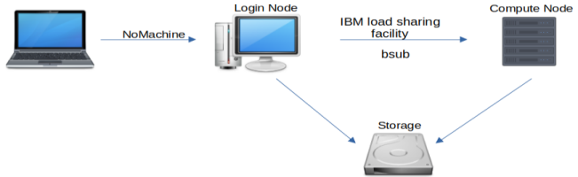

The HBS Grid uses [IBM Spectrum LSF](https://www.ibm.com/docs/en/spectrum-lsf) 
to run applications on powerful remote computers. LSF is a large and complex 
set of tools; our goal here is to give you just enough information so that you
can use it to run jobs on our system, without overwhelming you with details and
options.

---

!!! note inline end
    This software environment includes [robust graphical tools](menulaunch.md)
    that reduce the need to use the command line for many interactive tasks. This
    section is for those who prefer the command line, either for aesthetic reasons or
    because they need to submit batch jobs or carry out complex operations that cannot 
    be easily performed using graphical menu-driven tools.

LSF provides `bsub`, a command-line program for running applications on powerful remote
computers. For example, you can use

``` contents
bsub -q short_int -Is R
```

to start an interactive R job on a compute node. Breaking this example down will
make the basics of bsub clear:

-   `bsub` (**b**atch **sub**mission) is the top-level command used to run applications
    on powerful remote machines.
-   `-q short_int` means you want to run on the **short int**eractive **q**ueue (details
    below).
-   `-Is` means we are running an **I**nteractive **s**hell.
-   The rest of the command (`R` in this case) is the command that will be run on
    the remote machine.

!!! info "<a name='compute-cluster-basics'>Compute cluster basics</a>"
    When you first log in to the HBS Grid using *NoMachine* or *ssh* you are running
    on what we call a "login node". The *login nodes* do not have substantial CPU or
    RAM available. All computationally intensive processes should be run on what we
    call "compute nodes". A diagram of the HBS Grid architecture helps make this
    clear:
     
    {.media-small}
     
    As this diagram shows, the primary purpose of the *login nodes* is to serve as a hub 
    for launching jobs on powerful *compute nodes*. You can do that from the command line 
    using `bsub` or [from the desktop menu using application launchers](menulaunch.md).
    
    You may sometimes wish to run applications on the *login node*, and this is
    perfectly fine as long as you are not using it for computationally intensive work.
    For example, you may wish to run `ipython` to work out a small code example, or use
    `locate` to find a file you were working on. These low-resource activities can and
    should be done on the *login node*. The important thing to remember is that **`bsub` is
    used to run commands on powerful compute nodes**.

## Resource requirements

!!! info inline end Please keep in mind that **the system reserves the
    resources you select**, e.g., CPUs used by your job become
    unavailable for other users. **Request only 1 CPU** unless you
    know that you are using code or libraries that were written to run
    in parallel. Specific memory requirements depend on the nature of
    the job, but as a rough guide **we recommend requesting RAM 4-10
    times the size of your data**. For example, if you have a 6 Gb
    .csv file you may wish to request 24GB of memory or so.

The `bsub` command allows you to specify *RAM* and *CPU* requirements for your job via the `-M` and `-n` arguments. For example, you can run a python job with 50 GB of RAM
and 4 CPUs with

``` sh
bsub -q short_int -M 50G -n 4 -Is python
```

Knowing just these arguments to `bsub` will take you a long way. There is 
[much more to know about bsub](https://www.ibm.com/support/knowledgecenter/SSWRJV_10.1.0/lsf_command_ref/bsub.heading_options.1.html),
but these basics will get you started.

## Interactive and batch queue limits

Machines on the HBS Grid are grouped in **queues** and `bsub` can start jobs in either
*batch* (background) or *interactive* modes. *Batch* jobs make it easier to run
many jobs at once and are more efficient because jobs don't keep running after the
program is executed. Interactive jobs on the other hand tend to be more
convenient, especially for exploratory work or when developing or debugging a
script or program.

**Batch queues** including *short* and *long* are for running commands without interaction. For example

``` sh
bsub -q short Rscript my_r_code.R
```

runs `my_r_code.R` in batch mode, and

``` sh
bsub -q short stata -b my_stata_code.do
```

runs `my_stata_code.do` in batch mode.

!!! info inline end
    The key differences when submitting batch vs interactive jobs are the `-q` and
    `-Is` arguments. For example we used `-q short` for batch and `-q short_int` for 
    interactive. Interactive jobs must also include the `-Is` option.
    

**Interactive queues** like *short_int* and *long_int* are used to run
applications that you will interact with. For example,

``` sh
bsub -q short_int -Is rstudio
```

runs an interactive *RStudio* application, and

``` sh
bsub -q short_int -Is xstata
```

runs an interactive *Stata* application.

Queues have other characteristics<a name='queue-characteristics'> </a>in addition to the batch vs.
interactive distinction. These include the maximum run time and maximum
number of CPUs that can be reserved per job. These queue-level limits
are summarized in the table below.

 | Queue       | Type                   | Length     | Max Cores/Job   | 
 | ----------- | ---------------------- | ---------- | --------------- | 
 | long_int    | interactive            | 3 days     | 4               | 
 | short_int   | interactive            | 1 day      | 12              | 
 | sas_int     | interactive            | no limit   | 4               | 
 | long        | batch                  | 7 days     | 12              | 
 | short       | batch                  | 3 days     | 16              | 
 | gpu         | interactive or batch   | no limit   | 4               | 
 | sas         | batch                  | no limit   | 4               | 
 | unlimited   | interactive or batch   | no limit   | 4               | 

## Software environments

The available software environments contain a huge selection of graphical and
terminal-based tools and are described in [Software Applications and
Environments](environments.md). For the most part you shouldn't need to do
anything to install or configure these tools -- if there is some software you
would like that we don't have please get in touch and we'll see if we can install
and set it up for you.

In order to facilitate reproducible research and analysis we preserve old software
environments so that you can switch back to them later if needed. These older
environments can be loaded using [Lmod](https://lmod.readthedocs.io/en/latest/010_user.html).

Running
```
ml avail
```
will show you the available environments, named by date and version number.

For example, suppose that you have a python project and that your pandas code no
longer works with the latest pandas release in the current software environment.
In that case you can revert to a previous software environment and run your
analysis using an older version of pandas.

You can use the `ml` command from the terminal to *list*, *load*, and *unload* Lmod environment,
as shown below.

``` contents
      ml avail
      
        -------------- /usr/local/app/rcs_bin/techpreview-dev/modulefiles --------------
        rcs/rcs_2020.01 (E)    rcs/rcs_2021.01 (E)    rcs/rcs_2021.03 (E,L,D)


        Where:
        D:  Default Module
        E:  Technology Preview
        L:  Module is loaded
        
        Use "module spider" to find all possible modules.
        Use "module keyword key1 key2 ..." to search for all possible modules matching
        any of the "keys".
```

You can get detailed information about specific software modules using the
`ml spyder` command:

``` contents
      module spyder rcs/rcs_2021.03
      
        ---------------------------------------------------------------------------
        rcs: rcs/rcs_2021.03
        ---------------------------------------------------------------------------
        Description:
        Conda environment for research computing
        
        Help:
        Sets up environment for Data Science and Statistical computing.
        
        A huge list of software is avalable, including 'python', 'spyder', 'R', 
        'rstudio', 'emacs', 'vscode', rclone, ripgrep, nnn and much more.
        
        Key software versions:
        
        libgcc-ng 9
        cudatoolkit 10.1
        tensorflow-gpu 2.2
        python 3.8
        jupyterlab 3.0
        numpy 1.20
        pandas 1.2
        r-base 4.0
        r-tidyverse 1.3
        sas 9.4
        stata 16
        octave 6.2
        mathematica 12
        matlab R2020a
        emacs 27.1
        QGIS 3.16
        
        For a detailed software list open a terminal and run 
        
        conda env export -n rcs_2021.03
```

Finally you can use `ml` to load and unload specific environments.
```
ml rcs_2021.03
```
will load the *rcs_2021.03* environment, and 
```
ml -rcs_2021.03
```
will unload it.

Detailed [Lmod documentation is available here](https://lmod.readthedocs.io/en/latest/) and you can learn more about the environments available on the HBS Grid in the [Environments documentation](environments.md).
