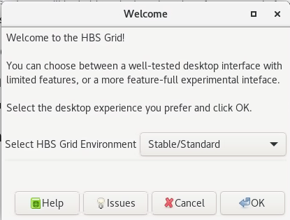

The software documented here is **under active development and may break or cause other problems**. 

---

## Issue reports and community discussion

Bug reports and feature requests are important contributions to this project
and are always welcome and encouraged! You can either start a discussion
at <https://github.com/hbs-rcs/hbsgrid-docs/discussions> or create an issue
report at <https://github.com/hbs-rcs/hbsgrid-docs/issues>. We are building a
friendly and welcoming community of HBS Grid users and we invite you to
join us using the links above.

## Basic troubleshooting steps

If you are experiencing problems with the desktop or application
launchers, a good first step is to re-start your desktop using the
*HBS Grid Configuration* utility in the *Applications => Accessories* menu.

If problems persist you can *terminate* your *NoMachine* session and start a new one. 
This will re-initialize your desktop environment and resolve many issues that can occur when your
settings get out of sync.

## Known bugs and work-arounds

### My application just disappeared!

Users are often surprised to find that their application just
disappears, often after running for several hours or days. Usually this
happens because your application was killed by the system after
exceeding a time or memory limit. For example, jobs running in the
*short interactive queue* are limited to a maximum runtime of 24 hours.
After 24 hours your job will be killed without warning or notice.
Similarly, the system will kill your job if it tries to use more memory
than you requested when you started the job.

You can avoid having your job killed by staying within the system and
job limits. These limits are described in more detail in 
[Handling system limits](../userguide/menulaunch.md#handling-system-limits) and
[Interactive and batch queue limits](../userguide/commandline.md#interactive-and-batch-queue-limits).

### Disabling the technology preview

If you wish you can disable technology preview features entirely by
starting the *HBS Grid configuration* utility and turning off the technology preview
features, as shown below.

{.media .media-block}

Selecting the *Stable/Standard* option under *HBS Grid launcher style*
will mostly restore your system to the original state. To ensure that your 
environment is completely reset terminate your NoMachine session and start a new one.
